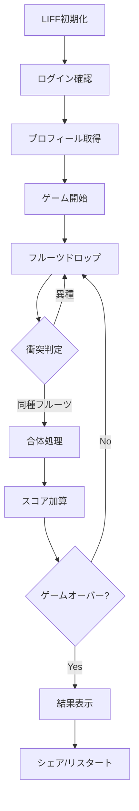

# Agents - スイカゲーム LIFF アプリケーション

## プロジェクト概要

LINE Front-end Framework (LIFF) を使用したスイカゲームのWebアプリケーションです。Matter.jsを使用した物理演算により、フルーツを落として合体させるゲームメカニクスを実装しています。

## 技術スタック

### フロントエンド
- **HTML5 Canvas**: ゲーム描画
- **Matter.js (v0.19.0)**: 2D物理エンジン
- **LIFF SDK (v2)**: LINE連携機能
- **Unity WebGL**: Unity統合サポート

### 開発環境
- **VSCode**: 統合開発環境 (このプロジェクトはVSCode上で開発されています)
- **Unity (2021.3+)**: ゲームエンジン（WebGL連携対応）
- Python HTTPS Server: ローカル開発用サーバー
- SSL証明書: HTTPS通信対応
- **Serena MCP**: AI開発支援ツール (Model Context Protocol)

### AI開発支援
- **Claude Code (VSCode Extension)**: AI支援コーディング環境
- **Serena**: セマンティックコード検索・編集機能
- **Language Server Protocol**: シンボルレベルのコード解析
- **MCP統合**: Claude Code VSCode拡張機能との連携

## ファイル構成

```
.
├── suika-liff.html          # メインゲームファイル (LIFF対応版)
├── suika.html               # スタンドアロン版
├── index.html               # 拡張版 (ランキング・サウンド機能付き)
├── tetris.html              # テトリスゲーム
├── https_server.py          # HTTPS開発サーバー
├── server.crt/key           # SSL証明書
├── README.md                # プロジェクト説明
├── agents.md                # このファイル
├── UNITY_INTEGRATION.md     # Unity連携ドキュメント
├── unity-liff-bridge.js     # Unity-LIFF Bridge (JavaScript)
├── unity-liff-template.html # Unity WebGL テンプレート
├── LIFFBridge.cs            # Unity-LIFF Bridge (C#)
├── GameManager.cs           # Unityゲームマネージャーサンプル
└── .serena/                 # Serena MCP設定
    └── project.yml          # プロジェクト設定
```

## 主要機能

### 1. ゲームメカニクス
- **フルーツシステム**: 11段階のフルーツ (🍇→🍉)
- **物理演算**: Matter.jsによるリアルな落下・衝突
- **合体ロジック**: 同じフルーツ同士の衝突で次段階へ進化
- **スコアリング**: フルーツ合体によるポイント獲得

### 2. LINE連携機能
- **LIFF認証**: LINE ログイン
- **プロフィール表示**: ユーザー名・アバター
- **シェア機能**: スコアと結果の友達共有
- **ShareTargetPicker**: LINE内での共有先選択

### 3. UI/UX
- **レスポンシブデザイン**: モバイル対応
- **タッチ操作**: スマートフォン最適化
- **ドロップライン**: フルーツ落下位置のガイド
- **ネクストプレビュー**: 次のフルーツ表示

## ゲームフロー



## フルーツ仕様

| レベル | 絵文字 | サイズ(px) | 色 | ポイント |
|--------|--------|------------|-----|----------|
| 0 | 🍇 | 18 | #9966cc | 1 |
| 1 | 🍒 | 22 | #dc143c | 3 |
| 2 | 🍓 | 26 | #ff1493 | 6 |
| 3 | 🍑 | 30 | #ff6347 | 10 |
| 4 | 🍊 | 34 | #ff8c00 | 15 |
| 5 | 🍎 | 38 | #ff0000 | 21 |
| 6 | 🍐 | 42 | #9acd32 | 28 |
| 7 | 🍍 | 46 | #ffd700 | 36 |
| 8 | 🥭 | 50 | #ff8c69 | 45 |
| 9 | 🍈 | 54 | #98fb98 | 55 |
| 10 | 🍉 | 58 | #ff6b6b | 66 |

## 物理エンジン設定

```javascript
engine.world.gravity.y = 0.8;          // 重力
restitution: 0.3                       // 反発係数
friction: 0.5                          // 摩擦
density: 0.001                         // 密度
```

## LIFF設定

- **LIFF ID**: 2008275057
- **エンドポイントURL**: HTTPS必須
- **必要な権限**: profile, shareTargetPicker

## 開発サーバーの起動

```bash
python https_server.py
```

- ポート: 8000 (HTTPS)
- 証明書: server.crt / server.key

## カスタマイズポイント

### フルーツ追加
`FRUITS`配列に新しいオブジェクトを追加:
```javascript
{ emoji: '🍌', size: 62, color: '#ffff00', points: 78 }
```

### 物理パラメータ調整
- 重力: `engine.world.gravity.y`
- 反発: `restitution`
- 摩擦: `friction`

### スコアシステム
- `handleCollisions()`: 合体時のポイント計算
- `FRUITS[type].points`: 各フルーツのポイント

## デバッグ情報

### よくある問題
1. **LIFF初期化エラー**: LIFF IDの確認
2. **シェア機能が動かない**: LINEアプリ内でのみ利用可能
3. **フルーツが消える**: 衝突検出のタイミング調整

### コンソールログ
- `LIFF初期化エラー`: LIFF SDK関連
- `プロフィール取得エラー`: 権限不足

## Unity連携システム

### 概要

Unity WebGLゲームとLIFFを統合するための完全なブリッジシステムを提供しています。

### 主要コンポーネント

1. **unity-liff-bridge.js**
   - JavaScript側のブリッジライブラリ
   - LIFF SDKとUnity WebGL間の通信を管理
   - イベント駆動型アーキテクチャ

2. **LIFFBridge.cs**
   - Unity C#側のブリッジスクリプト
   - JavaScript関数の呼び出し
   - コールバックイベント管理

3. **unity-liff-template.html**
   - Unity WebGL用のHTMLテンプレート
   - LIFF初期化とUnity読み込みの統合
   - レスポンシブUI

4. **GameManager.cs**
   - 使用例サンプル
   - スコア管理、データ保存/読み込み
   - UI統合のベストプラクティス

### 提供機能

- ✅ **ユーザー認証**: LINEプロフィール取得
- ✅ **データ共有**: スコア・結果のLINE共有
- ✅ **データ永続化**: LocalStorageでの保存/読み込み
- ✅ **QRスキャン**: カメラを使ったQRコード読み取り
- ✅ **外部リンク**: LINEアプリ内でのリンク開く
- ✅ **エディタ対応**: Unity Editor内での動作シミュレーション

### セットアップ

詳細は [UNITY_INTEGRATION.md](UNITY_INTEGRATION.md) を参照してください。

### クイックスタート

```csharp
// Unity側
LIFFBridge bridge = FindObjectOfType<LIFFBridge>();
bridge.OnLiffInitialized += (profile) => {
    Debug.Log($"ようこそ、{profile.displayName}さん！");
};
bridge.ShareGameScore(1000, "ハイスコア達成！");
```

## 今後の拡張案

- [x] Unity WebGL統合システム
- [ ] ランキング機能 (サーバーサイド連携)
- [x] サウンドエフェクト (Web Audio API) - index.htmlに実装済み
- [ ] アニメーション強化
- [ ] マルチプレイヤー対応（Unity連携で可能）
- [ ] アチーブメントシステム
- [x] より複雑な形状のフルーツ (多角形) - index.htmlに実装済み

## ライセンス

このプロジェクトは教育・学習目的で作成されています。

## Serena MCP セットアップ

### インストール

Serena MCPは既にこのプロジェクトに統合されています。以下のコマンドで追加されました:

```bash
claude mcp add serena -- \
   uvx --from git+https://github.com/oraios/serena \
   serena start-mcp-server --context ide-assistant --project "$(pwd)"
```

### 設定ファイル

#### グローバル設定
- 場所: `~/.serena/serena_config.yml`
- ダッシュボード: `http://localhost:24282/dashboard/`
- 主要設定:
  - `web_dashboard: true` - Webダッシュボード有効化
  - `log_level: 20` - ログレベル (info)
  - `tool_timeout: 240` - ツール実行タイムアウト

#### プロジェクト設定
- 場所: `.serena/project.yml`
- 設定内容:
  ```yaml
  project_name: suika-liff-game
  language: typescript
  read_only: false
  ```

### 主な機能

1. **セマンティック検索**: コードベース全体からシンボルを検索
2. **コード編集**: LSPベースの正確なコード編集
3. **シンボル解析**: 関数、クラス、変数の定義・参照を追跡
4. **リファクタリング支援**: 安全なコード変更をサポート

### 使用方法

Serenaは自動的にClaude Codeと統合されており、コードに関する質問や編集の際に自動的に使用されます。

### トラブルシューティング

- **ダッシュボードが開けない**: `http://localhost:24282/dashboard/` にアクセス
- **Language Serverエラー**: プロジェクトを再インデックス
  ```bash
  uvx --from git+https://github.com/oraios/serena serena project index
  ```
- **設定変更後**: Claude Codeを再起動

## 参考リンク

- [LIFF Documentation](https://developers.line.biz/ja/docs/liff/)
- [Matter.js](https://brm.io/matter-js/)
- [LINE Developers](https://developers.line.biz/)
- [Serena GitHub](https://github.com/oraios/serena)
- [Model Context Protocol](https://modelcontextprotocol.io/)
